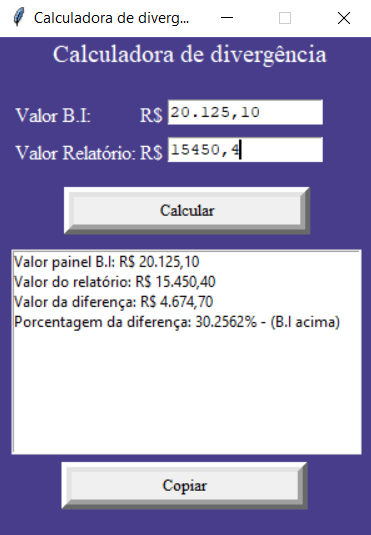

## Objetivo:
Desenvolver uma calculadora de divergência com interface gráfica que calcula a diferença de valores entre valor de um painel de B.I e valor de um Relatório de conferência, também apresentar a porcentagem de diferença entre os dois valores levando como maior peso o valor do painel B.I. Seus resultados devem seguir um mesmo padrão textual para confecção de múltiplas análises

## Solução proposta:
<b>Stacks:</b> 
Python: (tkinter, locale)

<b>Arquitetura:</b> 
A estrutura gráfica da calculadora consta dois objetos de imput(entrada de valores), o primeiro imput é referente ao valor de painel de B.I, o segundo imput a respeito do valor do relatório de conferência, mesmo que o usuário digite valores com ou sem ponto(.), o programa conseguiria reconhecer, converter e calcular perfeitamente. Logo a baixo dos imputs existe um botão chamado calcular, toda vez que pressionado o cálculo é feito e apresentado na Listbox(Bloco de texto) a baixo, por último existe um botão chamado copiar, esse botão copiara todo o texto já calculado no Listbox e com a formatação de valores no padrão brasileiro.

## Resultados:
<b>Problemas resolvidos: </b> A dificuldade do desenvolvimento fica em torno da biblioteca TK inter, devido as suas funções especiais para a confecção da interface e sua perfeita interação, foi necessário um esforço no estudo de sua documentação para o perfeito funcionamento da calculadora.

<b>Resultado final:</b>
A calculadora foi desenvolvida com sucesso, utilizada para uma demando onde foi necessário a análise múltiplas divergências de valores, a entrada de valores pode ser tanto no formato brasileiro como no formato americano, seu retorno faz a conversão de valores formatada automaticamente  no padrão brasileiro R$.

  
  <b>Calculador de Divergência</b>

